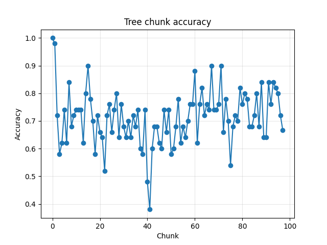
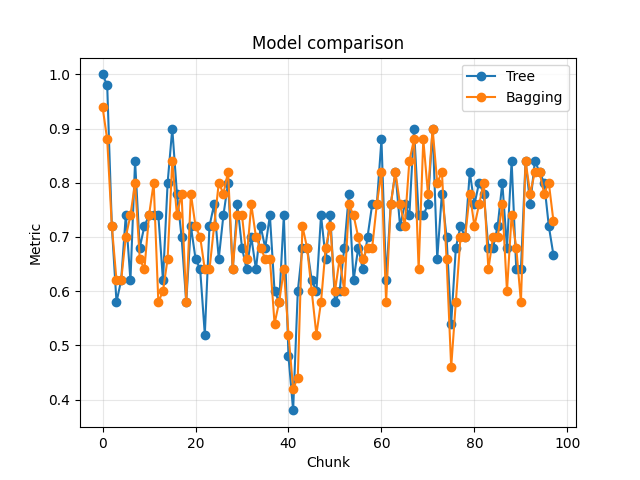

**Name:** Thomas Hoang

**Student ID:** A1984077

**Assignment:** Assignment 2.2 Programming Task 2

**Project:** NumCompute Stream

## Overview

This project is a streaming version of NumCompute. Instead of training once on all rows, the data is fed in small chunks and the pipeline updates step by step.

| Requirement        | Project part                                                                        |
| ------------------ | ----------------------------------------------------------------------------------- |
| Streaming learning | Models, preprocessing, stats, and metrics support **partial_fit()** or **update()** |
| Tree model         | **DecisionTreeClassifier**                                                          |
| Ensemble model     | **BaggingClassifier** with several trees                                            |
| Visualisation      | **visualise.py** with plots for accuracy and model comparision                      |
| Demo               | **demo/stream_demo.ipynb** using the white wine CSV                                 |
| Benchmark          | Tree vs bagging under the same streaming chunks                                     |

## Package Design

The new work is kept in **numcompute_stream/**. This keeps it seperate from the old Assignment 2.1 code, so the batch version does not get mixed with the streaming one.

| File                 | Purpose                                                                                      |
| -------------------- | -------------------------------------------------------------------------------------------- |
| **stats.py**         | Keep running mean, variance, and histogram values                                            |
| **metrics.py**       | Keep accuracy, AUC, confusion matrix, rolling metrics, precision, recall, and F1 over chunks |
| **preprocessing.py** | Update scaler, imputer, and encoder from new chunks                                          |
| **pipeline.py**      | Connect preprocessing and model with one shared **partial_fit()** call                       |
| **tree.py**          | Grow one decision tree as more chunks arrive                                                 |
| **ensemble.py**      | Train several trees and vote between them                                                    |
| **stream.py**        | Train one chunk, score it, and save logs                                                     |
| **visualise.py**     | Make plots for the demo and benchmark                                                        |

| API choice        | Why it is used                                      |
| ----------------- | --------------------------------------------------- |
| **partial_fit()** | Used when a component learns from a new chunk       |
| **update()**      | Used when a metric or statistic adds new values     |
| **predict()**     | Kept the same for tree and bagging                  |
| **StreamTrainer** | Keeps the notebook shorter and stores training logs |

## Model Design

| Model                 | How it works                                                                      | Notes                          |
| --------------------- | --------------------------------------------------------------------------------- | ------------------------------ |
| **DecisionTreeClas**  | One tree stores samples at leaves and tries to split when enough data is recieved | Fast and easy to inspect       |
| **BaggingClassifier** | Several trees train on bootstrap samples from each chunk                          | Slower but usually more stable |

Bagging was chosen because it is simple to connect with streaming chunks. For each new chunk, every tree gets its own sampled version of the chunk. After that, prediction is just majority voting.

## Demo Setup

The demo notebook loads the white wine dataset with **numcompute.io.load_csv()**. The quality column is changed into a binary target. Quality 6 or higher becomes class 1, and the rest becomes class 0.

| Demo item        | Result                        |
| ---------------- | ----------------------------- |
| Raw data shape   | 4898 rows and 12 columns      |
| Feature shape    | 4898 rows and 11 features     |
| Class count      | 1640 class 0 and 3258 class 1 |
| Chunk size       | 50 rows                       |
| Number of chunks | 98                            |
| Models compared  | Tree and bagging              |

| Step | What happens                             |
| ---: | ---------------------------------------- |
|    1 | Load CSV                                 |
|    2 | Split into chunks                        |
|    3 | Update **StandardScaler**                |
|    4 | Train model with **partial_fit()**       |
|    5 | Predict on the current chunk             |
|    6 | Save accuracy in **StreamTrainer.log\_** |
|    7 | Plot tree vs bagging accuracy            |

## Demo Results

The notebook shows the model working chunk by chunk. The last chunk and final cumulative scores are below.

| Model   | Last chunk accuracy | Final cumulative accuracy |
| ------- | ------------------: | ------------------------: |
| Tree    |               0.667 |                     0.713 |
| Bagging |               0.729 |                     0.705 |

The bagging model was also checked with streaming metrics after training.

| Metric                    | Result |
| ------------------------- | -----: |
| Precision                 |  0.957 |
| Recall                    |  0.696 |
| F1                        |  0.806 |
| AUC                       |  0.564 |
| Rolling accuracy last 200 |  0.775 |
| Rolling F1 last 200       |  0.868 |

| Confusion matrix | Predicted 0 | Predicted 1 |
| ---------------- | ----------: | ----------: |
| Actual 0         |         280 |        1360 |
| Actual 1         |         139 |        3119 |

The scaler also updated through the stream. The first three final mean values in the demo were **6.8548**, **0.2782**, and **0.3342**.

## Stability and Edge Cases

This section shows the checks used so the code does not break when chunks are small, missing values appear, or a split is not useful.

| Problem                   | Handling                                                                 |
| ------------------------- | ------------------------------------------------------------------------ |
| Running mean and variance | Keep count, mean, and spread values, then merge each new chunk into them |
| Zero standard deviation   | Replace zero scale with **1.0** before transform                         |
| NaN values                | The imputer skips NaNs when updating the column mean                     |
| Empty split in tree       | Reject the split                                                         |
| One-class leaf            | Do not split it                                                          |
| Same feature values       | Skip that feature for splitting                                          |
| Tie between split options | Choose the lower feature and lower threshold                             |
| Wrong input shape         | Raise a clear error before training                                      |

## Testing

There are 92 tests for **numcompute_stream/**, which is more than the required 30.

| Test area     | What is checked                                                               |
| ------------- | ----------------------------------------------------------------------------- |
| Stats         | Chunk updates match expected combined results                                 |
| Metrics       | Accuracy, AUC, rolling metrics, and other metrics build over multiple updates |
| Preprocessing | Scaler, imputer, and encoder learn over chunks                                |
| Pipeline      | Steps are called in the right order                                           |
| Tree          | Fit, predict, depth, single-class data, and split cases                       |
| Ensemble      | Tree count, bootstrap updates, and voting                                     |
| StreamTrainer | Logs, scoring, and cumulative accuracy                                        |
| Visualise     | Plot saving and invalid inputs                                                |

Testing helped me find small issues faster, especially shape mismatches and cases where an empty chunk should fail.

## Benchmark Results

For benchmark, the base tree and the ensemble are compared on the same streaming chunks.

| Benchmark item | Value                              |
| -------------- | ---------------------------------- |
| Dataset        | **assets/winequality-white.csv**   |
| Chunk size     | 50                                 |
| Chunks         | 98                                 |
| Base model     | **DecisionTreeClassifier**         |
| Ensemble model | **BaggingClassifier** with 5 trees |

| Model   | Avg fit time per chunk | Avg predict time per chunk | Final chunk accuracy | Final cumulative accuracy |
| ------- | ---------------------: | -------------------------: | -------------------: | ------------------------: |
| Tree    |                0.69 ms |                    0.03 ms |                0.667 |                     0.713 |
| Bagging |                2.34 ms |                    0.33 ms |                0.729 |                     0.705 |

The plots below were generated by **benchmark/streaming_models.py** on the same 98 chunks.

{width=45%}

{width=45%}

From the result, bagging is slower beacuse it trains and predicts with five trees. With this seed, bagging has better last chunk accuracy, but the tree has better cumulative accuracy.

## Problems Faced

| Problem                | Fix                                                        |
| ---------------------- | ---------------------------------------------------------- |
| Notebook import errors | Added a setup cell to find the package root                |
| Streaming tree design  | Stored samples and class counts at leaves before splitting |
| Zero variance values   | Made scaler avoid dividing by zero                         |
| Bagging randomness     | Used **random_state=42** for repeatable demo results       |
| Too much notebook code | Moved training and logging into **StreamTrainer**          |

The tree part took the most time because a normal decision tree expects all data at once. The main question was how a leaf should grow when only a chunk arrives.

## Reflection

This assignment helped me learn more about how decision trees are actually built. It was harder than expected, especially when the tree had to grow chunk by chunk instead of from one full dataset. AI was helpful for understanding the steps, but the code still needed checking and testing to make sure it matched the assignment.

Luckily, the old NumCompute codebase gave a good base to work from. The existing validation style, preprocessing ideas, and CSV loading made the streaming package easier to organise.

The hardest part was deciding how to grow the tree. A normal tree can see all data at once, but this version only receives one chunk at a time. The leaf needs to store enough information, update class counts, and only split when the data is useful.

There was also a lot of tedious work writing tests. The tests were not difficult one by one, but many edge cases had to be checked, like empty chunks, wrong shapes, zero variance, single-class data, and voting behaviour. This part took time, but it made the final package more reliable.

## AI Use Acknowledgement

Generative AI was used for planning, guiding the structure, and explaining hard parts of the assignment.

It also helped with repetitive work, especially drafting test cases and checking report wording.

The code, tests, demo results, and benchmark output were still reviewed and verified by me. I am fully aware of how the submitted code works.
